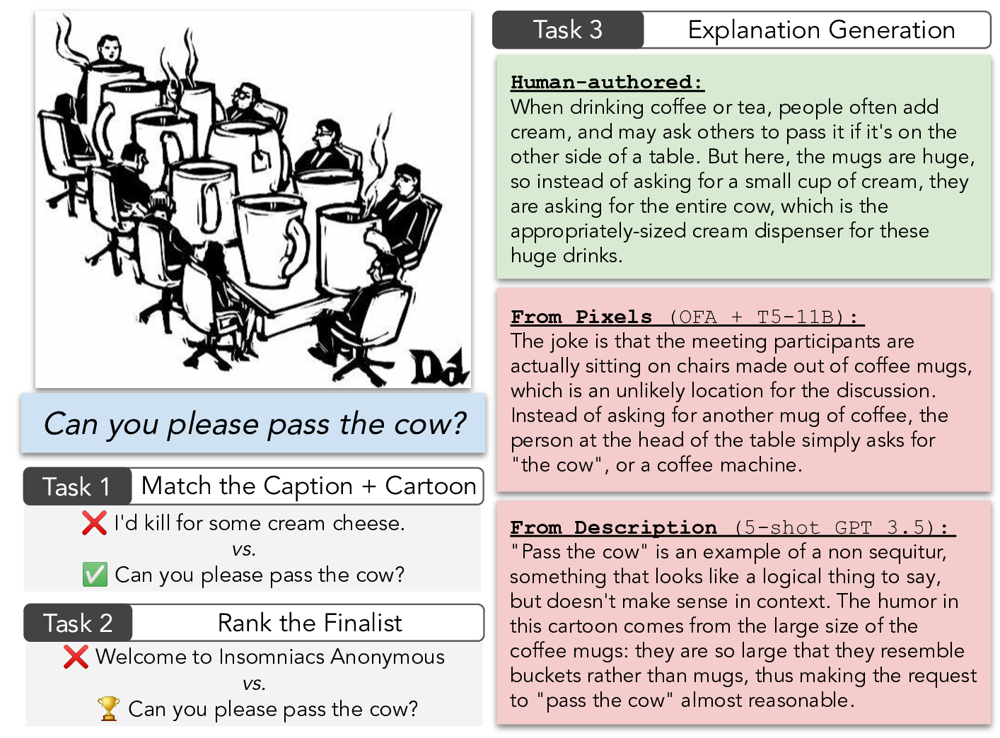
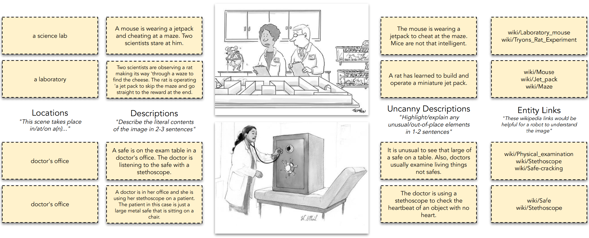

# Do Androids Laugh at Electric Sheep? Humor "Understanding" Benchmarks from The New Yorker Caption Contest


<p align="center">
  
</p>


This is the dataset to accompany [Do Androids Laugh at Electric Sheep? Humor "Understanding" Benchmarks from The New Yorker Caption Contest](https://arxiv.org/abs/2209.06293). The bibtex is:

```
@inproceedings{hessel2023androids,
  title={Do Androids Laugh at Electric Sheep? {Humor} ``Understanding'' Benchmarks from {The New Yorker Caption Contest}},
  author={Hessel, Jack and Marasovi{\'c}, Ana and Hwang, Jena D. and Lee, Lillian and Da, Jeff and Zellers, Rowan and Mankoff, Robert and Choi, Yejin},
  booktitle={Proceedings of the ACL},
  year={2023}
}
```

If you use this dataset, we would appreciate you citing our work, but also -- several other papers that we build this corpus upon. See [Citation Information](#citation). Models (e.g., t5-11b/OFA checkpoints), code (e.g., the evaluation scripts we used), etc. will be released soon.

#### Quickstart: access the data on the huggingface hub!

https://huggingface.co/datasets/jmhessel/newyorker_caption_contest

```python

from datasets import load_dataset

# load train/val/test splits for each task
dset = load_dataset("jmhessel/newyorker_caption_contest", "matching")
dset = load_dataset("jmhessel/newyorker_caption_contest", "ranking")
dset = load_dataset("jmhessel/newyorker_caption_contest", "explanation")

# load in the "from pixels" setting
dset = load_dataset("jmhessel/newyorker_caption_contest", "ranking_from_pixels")

# we ran in cross val (split 0 is default ^ ) so you can load splits 1/2/3/4 this way the 4th data split
dset = load_dataset("jmhessel/newyorker_caption_contest", "explanation_4")
# ... or split 1...
dset = load_dataset("jmhessel/newyorker_caption_contest", "explanation_from_pixels_1")

```

Here's an example instance from Matching:
```
{'caption_choices': ['Tell me about your childhood very quickly.',
                     "Believe me . . . it's what's UNDER the ground that's "
                     'most interesting.',
                     "Stop me if you've heard this one.",
                     'I have trouble saying no.',
                     'Yes, I see the train but I think we can beat it.'],
 'contest_number': 49,
 'entities': ['https://en.wikipedia.org/wiki/Rule_of_three_(writing)',
              'https://en.wikipedia.org/wiki/Bar_joke',
              'https://en.wikipedia.org/wiki/Religious_institute'],
 'from_description': 'scene: a bar description: Two priests and a rabbi are '
                     'walking into a bar, as the bartender and another patron '
                     'look on. The bartender talks on the phone while looking '
                     'skeptically at the incoming crew. uncanny: The scene '
                     'depicts a very stereotypical "bar joke" that would be '
                     'unlikely to be encountered in real life; the skepticism '
                     'of the bartender suggests that he is aware he is seeing '
                     'this trope, and is explaining it to someone on the '
                     'phone. entities: Rule_of_three_(writing), Bar_joke, '
                     'Religious_institute. choices A: Tell me about your '
                     "childhood very quickly. B: Believe me . . . it's what's "
                     "UNDER the ground that's most interesting. C: Stop me if "
                     "you've heard this one. D: I have trouble saying no. E: "
                     'Yes, I see the train but I think we can beat it.',
 'image': <PIL.JpegImagePlugin.JpegImageFile image mode=L size=323x231 at 0x7F34F283E9D0>,
 'image_description': 'Two priests and a rabbi are walking into a bar, as the '
                      'bartender and another patron look on. The bartender '
                      'talks on the phone while looking skeptically at the '
                      'incoming crew.',
 'image_location': 'a bar',
 'image_uncanny_description': 'The scene depicts a very stereotypical "bar '
                              'joke" that would be unlikely to be encountered '
                              'in real life; the skepticism of the bartender '
                              'suggests that he is aware he is seeing this '
                              'trope, and is explaining it to someone on the '
                              'phone.',
 'instance_id': '21125bb8787b4e7e82aa3b0a1cba1571',
 'label': 'C',
 'n_tokens_label': 1,
 'questions': ['What is the bartender saying on the phone in response to the '
               'living, breathing, stereotypical bar joke that is unfolding?']}
```

The label "C" indicates that the 3rd choice in the caption_choices is correct.


## Cartoon images

[You can download all of the contests images here.](https://storage.googleapis.com/ai2-jack-public/caption_contest_data_public/all_contest_images.zip) Each is named `X.jpeg` where `X` is the `contest_number`.

### Raw annotation files

<p align="center">
  
</p>

[The cartoon annotations described in the paper are here.](https://storage.googleapis.com/ai2-jack-public/caption_contest_data_public/all_newyorker_contest_annotations.json.zip) The keys in this json are the contest numbers. These map to:

```
{'contest_number': 322,
 'contest_source': 'bob',
 'contest_type': 'bob_okay',
 'official_newyorker_finalists': ['“On a clear day, I can get Santa Fe on the '
                                  'antenna.”',
                                  '"At the next canyon, I\'ll show you why."',
                                  "“Nope, it's not a new haircut. Try again.”"]
 'mturk_annotations': {'description_hit': [...],
                       'links_hit': [...]}
}
```
The contest source indicates whether the data was from the earlier dataset (`bob`), or the more recent datasets: `nextml_1` is from [here](https://github.com/nextml/caption-contest-data); `nextml_2` is from [here](https://nextml.github.io/caption-contest-data/). Contests with `contest_type` of `bob_small` were the set of images with low resolution that we treated with special care, as described in the paper.

The annotations themselves are stored in `description_hit` and `links_hit` respectively. For each contest, we ran the `description_hit` three times and the `links_hit` twice. Each entry in these lists corresponds to a single annotator's work (more details in paper). `description_hit` data looks like:

```
{'hash_worker_id': '20661b6a12f02ad760751e35d68cf3b6',
 'image_description': 'Two scientists are talking in a lab, with a cage full '
                      'of mice off to the left. One of the scientists is '
                      'dressed like a rat.',
 'image_uncanny_description': 'The scientist is wearing a rat costume instead '
                              'of a lab coat.',
 'question_1': 'Why is he dressed like that?',
 'question_2': None}
```

`question_X` was unused in our experiments, but we distribute it anyway. `None` indicates an optional question that did not get an answer. `links_hit` data looks like:

```
{'hash_worker_id': '9feb7ad429cbe82dcc6490b574465c13',
 'image_location': 'medical testing facility',
 'link_1': 'https://en.wikipedia.org/wiki/Scientist',
 'link_2': 'https://en.wikipedia.org/wiki/Laboratory_rat',
 'link_3': None}
```

[We also release a flattened version of our joke explanations here](https://storage.googleapis.com/ai2-jack-public/caption_contest_data_public/joke_explanations_flat.json.zip):

```
[{'caption': 'Please! I have a wife and two thousand kids!',
  'contest_number': 509,
  'explanation': 'A play on the common plea people use in dire situations: "I '
                 'have a wife and two kids;" this is stated to try to have '
                 'people take mercy and not kill someone. But here, the victim '
                 'of the bear is a fish about to be eaten, and fish tend to '
                 'have many more than two kids, so the phrase is updated with '
                 'the fish-version of it: two thousand kids.',
  'n_expl_toks': 70}, ... ]
```

But if you're hoping to report results in the same setting as the original paper, [please see below](#explanation)


### Other ways of accessing the data

[Task splits can be downloaded here.](https://storage.googleapis.com/ai2-jack-public/caption_contest_data_public/tasks.zip)
Because the size of the dataset is relatively small, we report
evaluation metrics averaged over the "test" portion of 5-fold
different cross validation splits. Each json has 3 keys: `train`,
`val`, `test`, and each of these keys gives a list of the examples in
the corresponding split.

```
tasks
├── contest_matching_split=0_cleaned.json
├── contest_matching_split=1_cleaned.json
...
├── explanation_generation_split=0_cleaned.json
├── explanation_generation_split=1_cleaned.json
...
├── quality_ranking_split=0_cleaned.json
├── quality_ranking_split=1_cleaned.json
...
```

#### Matching

Format of examples:

```
{'choices': [{'clean_caption': '"When is it ever a good time to break up?',
              'source': 'official_winner'},
             {'clean_caption': "They didn't specify which one, but your "
                               'insurance will only cover half.',
              'source': 'official_winner'},
             {'clean_caption': 'A bunny. Seriously. You see a bunny.',
              'source': 'crowd_winner'},
             {'clean_caption': "Do that again and I'll put the rubber bands "
                               'back on.',
              'source': 'crowd_winner'},
             {'clean_caption': 'I just do it for the healthcare.',
              'source': 'official_winner'}],
 'contest_number': 332,
 'correct_idx': 0,
 'split_idx_for_neg_match': 1}
```

`correct_idx` gives the index of the correct answer in this list,
which, in this case, is "When is it ever a good time to break
up?". `source` indicates if this was an official New Yorker finalist,
or a finalist from crowd voting.

#### Ranking

Format of examples:

```
{'A': "The neighborhood's not like I remembered it.",
 'B': 'Please! I have a wife and two thousand kids!',
 'contest_number': 509,
 'label': 'B',
 'winner_source': 'official_winner'}
```

`A`/`B` are the options to choose between, with `label` being the
correct answer.  `winner_source` gives where the correct answer comes
from (the incorrect answer is from a selection of "okay" captions as
determined by crowd voting --- see paper for more details).


#### Explanation

Format of examples:
```
{'caption': 'You know, I can never define irony, but I know it when I see it.',
 'contest_number': 607,
 'explanation': "It's extremely ironic that death himself would die: so ironic "
                'that the person points this out as an exemplar of the often '
                'difficult to pin down concept.',
 'n_expl_toks': 28}
```

Fields are self-explanatory, except `n_expl_toks`, which is the number
of tokens used in the perplexity calculation.


#### Annotations for tasks

For the "from description" setting described in the paper, at test time, only one description per cartoon is available.
For reproducibility, we use the same descriptions at val/test time between all algorithms. To facilitate fair comparison,
[we release per-split cartoon annotations here.](https://storage.googleapis.com/ai2-jack-public/caption_contest_data_public/annotations_per_split.zip)

```
annotations_per_split
├── split=0_newyorker_contest_annotations.json
├── split=1_newyorker_contest_annotations.json
├── split=2_newyorker_contest_annotations.json
├── split=3_newyorker_contest_annotations.json
└── split=4_newyorker_contest_annotations.json
```

These files have the [same format described above](#annotations), but the val/test sets only have
a single fixed description/link HIT, so we recommend using these annotations if you are running
in the "from description" cross-validation setup.

## Citation

Our data contributions are:

1. The cartoon-level annotations;
2. The joke explanations;
3. and the framing of the tasks

We release these data we contribute under CC-BY (see DATASET_LICENSE).

If you find this data useful in your work, in addition to citing our contributions, please also cite the following, from which the cartoons/captions in our corpus are derived:
```
@misc{newyorkernextmldataset,
  author={Jain, Lalit  and Jamieson, Kevin and Mankoff, Robert and Nowak, Robert and Sievert, Scott},
  title={The {N}ew {Y}orker Cartoon Caption Contest Dataset},
  year={2020},
  url={https://nextml.github.io/caption-contest-data/}
}

@inproceedings{radev-etal-2016-humor,
  title = "Humor in Collective Discourse: Unsupervised Funniness Detection in The {New Yorker} Cartoon Caption Contest",
  author = "Radev, Dragomir  and
      Stent, Amanda  and
      Tetreault, Joel  and
      Pappu, Aasish  and
      Iliakopoulou, Aikaterini  and
      Chanfreau, Agustin  and
      de Juan, Paloma  and
      Vallmitjana, Jordi  and
      Jaimes, Alejandro  and
      Jha, Rahul  and
      Mankoff, Robert",
  booktitle = "LREC",
  year = "2016",
}

@inproceedings{shahaf2015inside,
  title={Inside jokes: Identifying humorous cartoon captions},
  author={Shahaf, Dafna and Horvitz, Eric and Mankoff, Robert},
  booktitle={KDD},
  year={2015},
}
```
